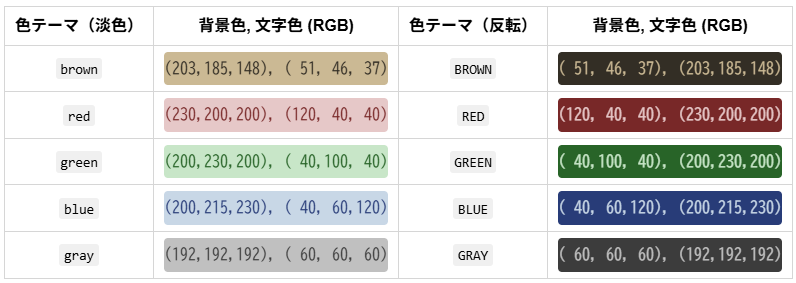

# nepub

> [!NOTE]
> こちらは自分用 (mkomuro) の開発／テスト版ブランチ。

「小説家になろう」および「カクヨム」の小説を縦書きの EPUB に変換するためのツール

## Requirements

- Python 3
  - 3.12 ~~3.10~~ で動作確認しています

## Installation
**main ブランチ:** なるべくフォーク元を維持する予定
```sh
pip install git+https://github.com/mkomuro/nepub.git
```

**dev ブランチ:** mkomuro 自分用なので main にマージしないかもしれない
```sh
pip install git+https://github.com/mkomuro/nepub.git@dev
```
あるいは
```sh
git clone -b dev https://github.com/mkomuro/nepub.git nepub-dev
pip install --no-cache-dir -e nepub-dev
```


## Usage

```sh
$ nepub -h
usage: nepub [-h] [-i] [-t] [-r <range>] [-o <file>] [-k] [-c [<jpeg_file>]] novel_id

positional arguments:
  novel_id              novel id

options:
  -h, --help            show this help message and exit
  -i, --illustration    Include illustrations (Narou only)
  -t, --tcy             Enable Tate-Chu-Yoko conversion
  -r <range>, --range <range>
                        Specify the target episode number range using
                        comma-separated values (e.g., "1,2,3") or a range notation (e.g., "10-20").
  -o <file>, --output <file>
                        Output file name. If not specified, ${novel_id}.epub is used.
                        Update the file if it exists.
  -k, --kakuyomu        Use Kakuyomu as the source
  -c                    Inserts a generated JPEG image into the EPUB file as a cover page (named 
                        'cover.jpg' with the 'brown' color theme).
  --cover <jpeg_file> or <color_theme>
                        Inserts the specified JPEG image (or specified <color_theme> JPEG image) 
                        into the EPUB file as a cover page.
```

Example:

```sh
$ nepub xxxx
novel_id: xxxx, illustration: False, tcy: False, output: xxxx.epub, kakuyomu: False
cover_jpeg: None
xxxx.epub found. Loading metadata for update.
3 episodes found.
Start downloading...
Download skipped (already up to date) (1/3): https://ncode.syosetu.com/xxxx/1/
Download skipped (already up to date) (2/3): https://ncode.syosetu.com/xxxx/2/
Downloading (3/3): https://ncode.syosetu.com/xxxx/3/
Download is complete! (new: 1, skipped: 2)
Updated xxxx.epub.
```

※ xxxx の部分には小説ページの URL の末尾部分 (`https://ncode.syosetu.com/{ここの文字列}/`) に置き換えてください。

## mkomuro/nepub の変更点 (Upstream との違い)
上記の「Installation」にも記載しましたが、`dev`ブランチ側のみに変更を加えています。

### 【仕様変更１】連続する空行の処理
空行が連続する場合の処理を変更しました。
|mkomuro/nepub (`dev`ブランチ)|Upstream 版 (`main`ブランチ)|
|:-:|:-:|
|1 行 &rarr; 1 行|1 行 &rarr; 削除|
|2 行以上 &rarr; 2 行|2 行以上 &rarr; 1 行|

### 【機能追加１】表紙画像を挿入
自分が使用している一部の EPUB ビューワーソフトが EPUB 本文に含まれている挿絵の画像ファイルをアイコン画像として「本棚」機能でサムネイル表示してしまうため、表紙画像を EPUB ファイルに挿入する機能を追加しました。

主に 3 種類のオプションがあります。
#### 1. `-c` オプション

```sh
# -c [<jpeg_file>], --cover [<jpeg_file>]
#     Insert a cover JPEG image in the EPUB file (optional: specify filename)

nepub -i -t -c <novel_id>
```

`-c` オプションで下記のサンプル画像のような表紙を挿入します。表紙の「タイトル」と「作者名」は Web から取得したのものがそのまま埋め込まれます。

<!--  -->
<p align="center">

</p>

生成される JPEG 表紙画像には、以下の属性が設定されています。画像サイズなどの属性を変更したい場合は、cover.py ソースコードの修正が必要です。
```sh
# A6 (300dpi) 相当を期待したピクセル数
$ exiftool size-A6-short-cover.jpg
ExifTool Version Number         : 12.76
File Name                       : size-A6-short-cover.jpg
Directory                       : .
File Size                       : 75 kB
File Modification Date/Time     : 2025:12:30 19:56:31+09:00
File Access Date/Time           : 2025:12:30 19:57:02+09:00
File Inode Change Date/Time     : 2025:12:30 19:56:31+09:00
File Permissions                : -rw-r--r--
File Type                       : JPEG
File Type Extension             : jpg
MIME Type                       : image/jpeg
JFIF Version                    : 1.01
Resolution Unit                 : inches
X Resolution                    : 300
Y Resolution                    : 300
Exif Byte Order                 : Big-endian (Motorola, MM)
Image Description               : Web novel cover image for nepub
Software                        : nepub
Modify Date                     : 2025:12:30 19:56:31
Artist                          : nepub/dev
Copyright                       : Copyright (c) 2025 mkomuro
Date/Time Original              : 2025:12:30 19:56:31
Create Date                     : 2025:12:30 19:56:31
User Comment                    : 小説タイトル：小説のタイトル名（Ａ６）／著者：小説の作者名
Image Width                     : 1240
Image Height                    : 1748
Encoding Process                : Baseline DCT, Huffman coding
Bits Per Sample                 : 8
Color Components                : 3
Y Cb Cr Sub Sampling            : YCbCr4:2:0 (2 2)
Image Size                      : 1240x1748
Megapixels                      : 2.2
```

<!--
$ file -b size-A6-short-cover.jpg | sed 's/, /\n - /g'
JPEG image data
 - JFIF standard 1.01
 - resolution (DPI)
 - density 300x300
 - segment length 16
 - Exif Standard: [TIFF image data
 - big-endian
 - direntries=6
 - description=Web novel cover image for nepub
 - software=nepub
 - datetime=2025:12:30 19:56:31]
 - baseline
 - precision 8
 - 1240x1748
 - components 3
-->

#### 2. `--cover <color_theme>` オプション

また、`-c` の代わりに `--cover` を用いて `<color_theme>` を指定すれば、自動生成される画像の色をプリセットされた「色テーマ」から選択できます。
```sh
nepub -i -t --cover <color_theme> <novel_id>
```

色テーマ見本： `brown` が上記のデフォルト色です。（ `-c` 指定時と同じ色）



<!--
<style>
  .color-theme-swatch {
    display: inline-block;
    #width: 120px;
    padding: 4px 0;
    border-radius: 4px;
    font-family: monospace;
  }

  .color-theme-table th, .color-theme-table td {
    padding: 6px 10px;
    text-align: center;
  }
</style>
<table class="color-theme-table">
  <thead>
    <tr>
      <th>色テーマ（淡色）</th>
      <th>背景色, 文字色 (RGB)</th>
      <th>色テーマ（反転）</th>
      <th>背景色, 文字色  (RGB)</th>
    </tr>
  </thead>
  <tbody>
    <tr>
      <td><code>brown</code></td>
      <td><span class="color-theme-swatch" style="background-color:rgb(203, 185, 148);color:rgb(51, 46, 37);">(203,185,148), ( 51, 46, 37)</span></td>
      <td><code>BROWN</code></td>
      <td><span class="color-theme-swatch" style="background-color:rgb(51, 46, 37);color:rgb(203, 185, 148);">( 51, 46, 37), (203,185,148)</span></td>
    </tr>
    <tr>
      <td><code>red</code></td>
      <td><span class="color-theme-swatch" style="background-color:rgb(230, 200, 200);color:rgb(120, 40, 40);">(230,200,200), (120, 40, 40)</span></td>
      <td><code>RED</code></td>
      <td><span class="color-theme-swatch" style="background-color:rgb(120, 40, 40);color:rgb(230, 200, 200);">(120, 40, 40), (230,200,200)</span></td>
    </tr>
    <tr>
      <td><code>green</code></td>
      <td><span class="color-theme-swatch" style="background-color:rgb(200, 230, 200);color:rgb(40, 100, 40);">
      (200,230,200), ( 40,100, 40)
      </span></td>
      <td><code>GREEN</code></td>
      <td><span class="color-theme-swatch" style="background-color:rgb(40, 100, 40);color:rgb(200, 230, 200);">
      ( 40,100, 40), (200,230,200)
      </span></td>
    </tr>
    <tr>
      <td><code>blue</code></td>
      <td><span class="color-theme-swatch" style="background-color:rgb(200, 215, 230);color:rgb(40, 60, 120);">
      (200,215,230), ( 40, 60,120)
      </span></td>
      <td><code>BLUE</code></td>
      <td><span class="color-theme-swatch" style="background-color:rgb(40, 60, 120);color:rgb(200, 215, 230);">
      ( 40, 60,120), (200,215,230)
      </span></td>
    </tr>
    <tr>
      <td><code>gray</code></td>
      <td><span class="color-theme-swatch" style="background-color:rgb(192, 192, 192);color:rgb(60, 60, 60);">
      (192,192,192), ( 60, 60, 60)
      </span></td>
      <td><code>GRAY</code></td>
      <td><span class="color-theme-swatch" style="background-color:rgb(60, 60, 60);color:rgb(192, 192, 192);">
      ( 60, 60, 60), (192,192,192)
      </span></td>
    </tr>
  </tbody>
</table>
-->

#### 3. `--cover <jpeg_file>` オプション

`--cover` オプションで「JPEG画像ファイル名」を指定すると、画像の自動生成は行われず、指定したファイルが表紙として EPUB に挿入されます。
```sh
nepub -i -t --cover <jpeg_file> <novel_id>
```


### 【機能追加２】任意の「タイトル名」と「作者名」を埋め込んだ表紙画像の生成
`-c` や `--cover <color_theme>` では、Web から取得した小説のタイトルが JPEG 表紙画像に埋め込まれます。

Web から取得したタイトルや作者名を表紙に反映させたくない場合は、あらかじめ任意の情報を埋め込んだ JPEG 画像を自身で作成しておくことが可能です。以下に、上記のサンプルと同じ表紙画像を生成する際のコマンド例を記載します。
```sh
# nepub.cover "novel_title" "novel_author" "jpeg_filename" \
#   "A6 | B6 | KINDLE" \
#   "brown | red | green | blue | gray | BROWN | RED | GREEN | BLUE | GRAY"
#
# サイズ: (W,H)ピクセル数 = (<長さ>mm / 25.4mm) * 300dpi
#   A6: (W,H) = 約(1240, 1748)px, 文庫本相当(105mm:148mm = 1:1.41)
#   B6: (W,H) = 約(1512, 2150)px, 単行本相当(128mm:182mm = 1:1.42)
#   KINDLE: (W,H) = (1816, 2560)px, (1:1.41)
#     [Note] https://kdp.amazon.co.jp/ja_JP/help/topic/G6GTK3T3NUHKLEFX
#
# 色テーマ:
#   brown: 茶色系の画像（デフォルト色）、
#   red: 赤系、green: 緑系、blue: 青系、gray: グレー系
#   ※ 大文字で指定すると背景色、文字色を反転。詳細は上記の「色テーマ見本」の表を参照。
#

python -m nepub.cover \
    "小説のタイトル名" \
    "小説の作者名" \
    "size-A6-short-cover.jpg" \
    "A6" \
    "brown"
```

生成した JPEG 表紙画像を `--cover` オプションの引数として指定すると、その画像が EPUB ファイルの表紙として挿入されます。
```sh
nepub -i -t --cover "size-A6-short-cover.jpg" -o "小説のタイトル名.epub" <novel_id>
```

## 免責事項

> [!NOTE]
> 免責事項、ライセンスなどは、フォーク元のレポジトリと同様です。フォーク元と本レポジトリの同期がずれた場合でも（同期が遅れてしまった場合でも）基本的にはフォーク元に従うようにしますのでフォーク元のレポジトリも同時に参照してください。

本ツールは、小説投稿サイト「小説家になろう」および「カクヨム」の小説を縦書きの EPUB に変換するための非公式ツールです。
本ツールは株式会社ヒナプロジェクトおよび株式会社 KADOKAWA とは一切関係がありません。

「小説家になろう」は、株式会社ヒナプロジェクトの登録商標です。
「カクヨム」は、株式会社 KADOKAWA の登録商標です。

### 注意事項

* 自分用に作成したため、最低限読める EPUB を出力する機能しかありません
* 「小説家になろう」および「カクヨム」のサーバーに負荷をかけないよう、ご注意ください
* 本ツールの使用によって生じたいかなる結果についても責任を負いません。ご使用は自己責任でお願いいたします。
